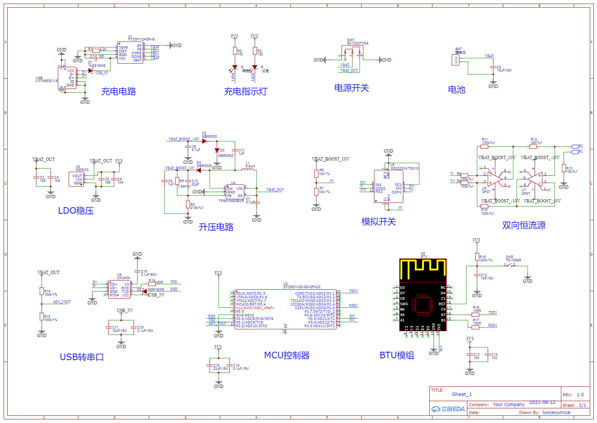
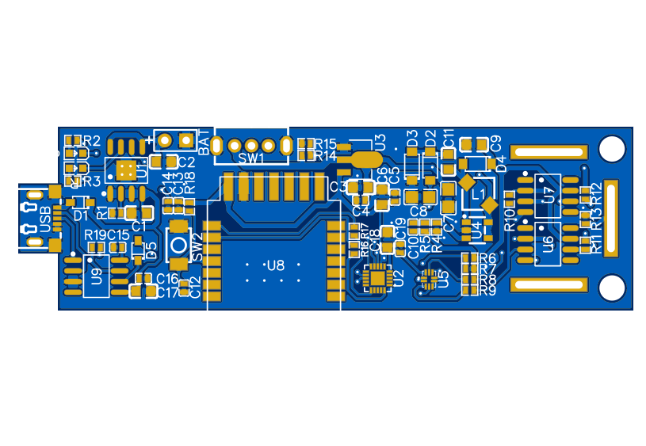
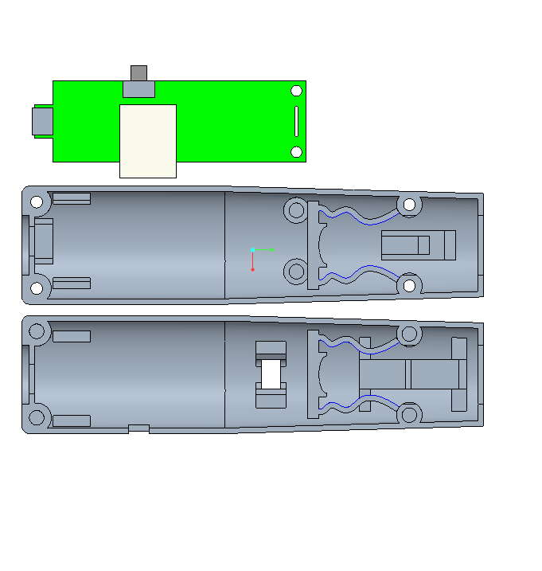

This project is developed using Tuya SDK, which enables you tu quickly develop branded apps connecting and controlling smart scenarios of many devices. For more information, please check Tuya Developer Website.

## 电路原理图

## PCB设计

## 外壳设计
